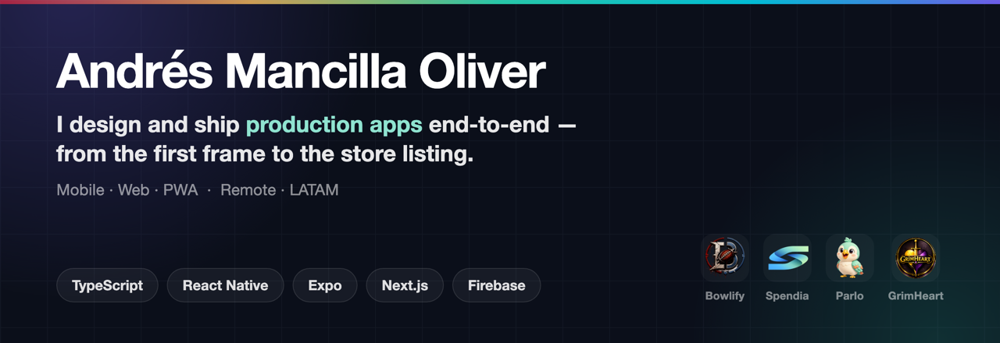

  

# Andrés Mancilla Oliver

**Diseño y publico aplicaciones de principio a fin.** Del primer boceto a la tienda: producto, sistema de diseño, código y release.

Remoto · LATAM · [English](./README.md)

---

## Qué construyo

Productos multiplataforma donde un mismo código sirve web, PWA y nativo — React Native (Expo) y Next.js, siempre TypeScript. Me hago cargo de todo: sistemas de diseño, i18n, datos offline-first, autenticación y publicación.

## Proyectos destacados

| Proyecto | Qué es | Stack |
|---|---|---|
| **[Bowlify](https://github.com/andresmancilla08/Bowlify)** · [bowlify.co](https://bowlify.co) | Gestor de ligas de Blood Bowl — equipos, partidos, clasificaciones, torneos, progresión de jugadores y lesiones. El motor de reglas de un juego de mesa, modelado entero. | Expo · React Native · Firestore · Zustand |
| **[Spendia](https://github.com/andresmancilla08/Spendiapp)** · [live](https://spendia.vercel.app) | PWA de finanzas personales — control de gastos, gastos compartidos con amigos e insights proactivos con IA. Trilingüe ES/EN/IT. | Expo · Firebase · i18next |
| **[Parlo](https://github.com/andresmancilla08/Parlo)** · [live](https://parlo-lilac.vercel.app) | Aprende inglés con un tutor de IA que corrige y explica *el porqué* en español. Currículo A1–C2, repaso espaciado, pronunciación y gamificación. | Next.js 16 · Gemini · Firebase |
| **[GrimHeart](https://github.com/andresmancilla08/GrimHeart)** · [grimheart.co](https://grimheart.co) | Hojas de personaje mobile-first para el TTRPG Daggerheart. Bilingüe, con creación y subida de nivel completas. | Next.js · Firebase · PWA |
| **[FilmSpace](https://github.com/andresmancilla08/FilmSpace)** · [live](https://filmspace-two.vercel.app) | Plataforma de streaming de películas, series y anime — para web y Google TV, con módulo de IPTV en directo. | Next.js 15 · Tailwind · hls.js |

## Ahora

Construyendo **Parlo** — tutor de inglés que explica las correcciones en español; ahora mismo, currículo B2 y test de nivel. **Bowlify** y **Spendia** siguen en producción con usuarios reales.

## Stack

**Lenguajes** — TypeScript · JavaScript
**Móvil** — React Native · Expo · EAS Build · React Navigation
**Web** — Next.js (App Router) · React · Tailwind · Framer Motion · PWA / Service Workers
**Backend y datos** — Firebase (Auth, Firestore, Storage, Rules) · NestJS · MongoDB · REST
**Oficio** — Sistemas de diseño · i18n (i18next) · Zustand · accesibilidad · Vercel

## Cómo trabajo

- **Sistema de diseño primero.** Tokens antes que componentes, componentes antes que pantallas — por eso estas apps se ven intencionadas y no ensambladas.
- **Publicar para usuarios reales.** Todo lo de arriba está desplegado y en uso, no son repos de tutorial.
- **Multiidioma por defecto.** Cero textos hardcodeados; varios de estos proyectos van en tres idiomas.
- **Un código, varias plataformas** cuando tiene sentido — solo nativo cuando no lo tiene.

## Hablemos

Abierto a **roles remotos** y **proyectos freelance** — MVPs, apps móviles, sistemas de diseño.

[andresmancilla08@gmail.com](mailto:andresmancilla08@gmail.com) · [LinkedIn](https://www.linkedin.com/in/andresmancillao/)
